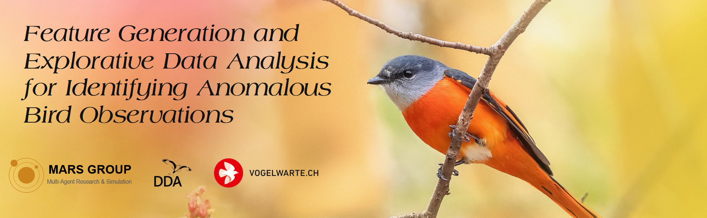

In this subsection, all notebooks related to Feature Generation and Explorative Data Analysis for identifying anomalous bird observations in data from *ornitho.ch* and *ornitho.de* are collected.
<br><br><br>

## Structure

**Part of Grundprojekt:**
- `data_analysis` This folder contains the data analysis.

- `feature_generation` This folder includes all the notebooks for feature generation. This includes, land use generation with LUCAS and CLC, weather generation and altitude generation.

- `feature_generation` In this folder are some utility files like the .py file to generate the altitude with CopernicusDEM.

**Part of Hauptprojekt:**
<br><br><br>

## Dataset Download
The required datasets to run each Notebook are linked in the respective Notebooks.<br>
All data can be found here: https://drive.google.com/drive/folders/1Of664UN6K9zs8SHYmgKMFKQ1gjXanwH9
<br><br><br>

## Provided file types
Each Notebook is provided as `.ipynb` and as `.html`. 

Use `.ipynb` files to:
- run the code locally (dependencies need to be installed)
- view the executed notebook with static outputs on GitHub (some outputs might not display correctly)

Use `.html` files to:
- view the executed notebooks
<br><br><br>

## Setup

#### 1. Clone repository

```console
git clone https://github.com/marinasie/bird-sighting-validation.git
```
#### 2. Install dependencies

```
cd bird-sighting-validation/simon/
pip install -r requirements.txt
```